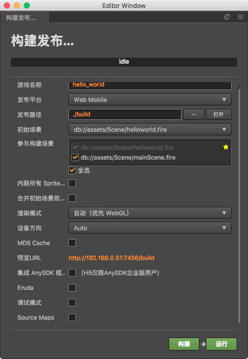
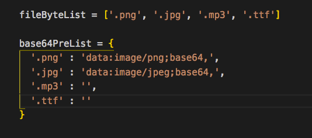

# 如何将creator项目打包成facebook playable game广告

## 1.导出web-mobile项目

> 按照图中显示的勾选导出配置

## 2.复制脚本到自己的项目

> 将项目中的`compile.py`和`build-templates`文件夹拷贝到自己的项目中

## 3.运行脚本打包

> 在项目的根目录运行脚本

`python compile.py`

> 脚本执行完毕后，双击`build/web-mobile/index.html`可以直接运行游戏

* ***注意事项***



***1.目前支持的二进制文件只有这4种有特殊需要可自行添加***

***2.目前不知支持使用字体文件(ttf)***

***3.本项目使用creator1.9.2打包***
